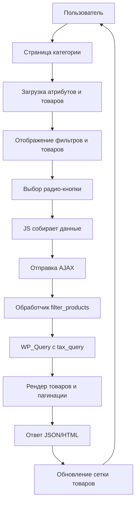

# Детальный план реализации фильтрации по атрибутам

## Обзор
Нужно добавить на страницу категории товаров блок фильтров по атрибутам (радио-кнопки) и реализовать AJAX-фильтрацию с пагинацией.

## Исходные данные
- Таксономия `product_attr` уже зарегистрирована (иерархическая, родительские термины — группы атрибутов, дочерние — значения).
- Есть функция `my_cat_list_filter` для вывода радио-фильтров по таксономии (можно адаптировать).
- Есть пример JS-кода для AJAX-фильтрации (нужно адаптировать под атрибуты).
- На странице категории (`template-parts/taxonomy/content-product_category.php`) уже выводится список товаров через `WP_Query` (без пагинации).

## Шаги реализации

### 1. Функция получения атрибутов для категории
**Файл:** `inc/utilities.php`

Создать функцию `get_category_attributes($category_id)`:
```php
function get_category_attributes($category_id) {
    // Получаем ID товаров в данной категории
    $product_ids = get_posts(array(
        'post_type' => 'product',
        'posts_per_page' => -1,
        'fields' => 'ids',
        'tax_query' => array(
            array(
                'taxonomy' => 'product_category',
                'field' => 'term_id',
                'terms' => $category_id,
            ),
        ),
    ));

    // Получаем все группы атрибутов (родительские термины)
    $groups = get_terms(array(
        'taxonomy' => 'product_attr',
        'parent' => 0,
        'hide_empty' => false,
    ));

    $result = array();
    foreach ($groups as $group) {
        // Получаем значения этой группы
        $values = get_terms(array(
            'taxonomy' => 'product_attr',
            'parent' => $group->term_id,
            'hide_empty' => false,
        ));

        // Фильтруем только те значения, которые есть у товаров категории
        $filtered_values = array();
        foreach ($values as $value) {
            $count = get_objects_in_term($value->term_id, 'product_attr', $product_ids);
            if ($count > 0) {
                $filtered_values[] = $value;
            }
        }

        if (!empty($filtered_values)) {
            $result[] = array(
                'group' => $group,
                'values' => $filtered_values,
            );
        }
    }

    return $result;
}
```

### 2. Функция вывода фильтров
**Файл:** `inc/utilities.php`

Создать функцию `the_category_attribute_filters($category_id)` на основе `my_cat_list_filter`, но для атрибутов:
- Использовать HTML-структуру из предоставленного шаблона (с классами `category__unit`, `collapse`).
- Для каждой группы атрибутов вывести радио-кнопки со значениями.
- Добавить скрытое поле "Все" для сброса выбора внутри группы.
- Использовать `data-` атрибуты для передачи `category_slug`, `attribute` (slug группы), `value` (term_id).

### 3. Изменение шаблона категории
**Файл:** `template-parts/taxonomy/content-product_category.php`

- Добавить вызов `the_category_attribute_filters($term_id)` перед секцией `#products`.
- Обернуть секцию товаров в контейнер с классом `filter__content` (как в примере JS), чтобы JS мог обновлять содержимое.
- Добавить пагинацию (использовать `paginate_links`). Изначально пагинация отключена (`posts_per_page => -1`), нужно изменить на разумное значение (например, 12) и добавить параметр `paged`.
- Добавить блок-прелоадер `.preloaderFilter-js` для индикации загрузки.

### 4. AJAX-обработчик
**Файл:** `inc/filter-ajax.php` (новый) или добавить в `inc/utilities.php`

Создать обработчик `ajax_filter_products_by_attributes()`:
- Принимает `category_id` и массив `attributes` (где ключ — slug группы, значение — term_id значения).
- Строит `tax_query` с отношением `AND` между группами (каждая группа должна соответствовать выбранному значению).
- Возвращает HTML товаров и пагинацию.

Пример структуры `tax_query`:
```php
$tax_query = array('relation' => 'AND');
foreach ($attributes as $attribute_slug => $term_id) {
    $tax_query[] = array(
        'taxonomy' => 'product_attr',
        'field' => 'term_id',
        'terms' => $term_id,
    );
}
// Добавляем условие по категории
$tax_query[] = array(
    'taxonomy' => 'product_category',
    'field' => 'term_id',
    'terms' => $category_id,
);
```

Зарегистрировать действия:
```php
add_action('wp_ajax_filter_products', 'ajax_filter_products_by_attributes');
add_action('wp_ajax_nopriv_filter_products', 'ajax_filter_products_by_attributes');
```

### 5. JavaScript
**Файл:** `assets/js/filter-attributes.js` (новый) или добавить в `assets/js/function.js`

Адаптировать предоставленный JS-код:
- Селекторы изменить под структуру фильтров атрибутов.
- Функция `getCat()` должна собирать выбранные значения атрибутов (возможно, несколько групп).
- Отправлять `attributes` как объект.
- Обновлять `.filter__content` (сетка товаров) и пагинацию.

### 6. Пагинация с AJAX
- При клике на ссылку пагинации перехватывать событие, предотвращать переход, отправлять AJAX с параметром `paged`.
- В обработчике учитывать `paged` при формировании `WP_Query`.

### 7. Интеграция
- Подключить новый JS-файл в `functions.php` через `wp_enqueue_script`.
- Убедиться, что AJAX-обработчик загружен (добавить `require_once` в `functions.php`).

### 8. Стили (опционально)
- Проверить, что классы `.category__unit`, `.collapse` уже стилизованы. Если нет, добавить минимальные стили.

## Порядок выполнения
1. Создать функцию `get_category_attributes`.
2. Создать функцию `the_category_attribute_filters` и вывести её в шаблоне.
3. Реализовать AJAX-обработчик.
4. Написать JS.
5. Добавить пагинацию в исходный запрос товаров.
6. Протестировать.

## Диаграмма взаимодействия



## Тестирование
- Убедиться, что фильтры выводятся для категории, у товаров которой есть атрибуты.
- Проверить, что выбор значения фильтрует товары.
- Проверить сброс фильтра (выбор "Все").
- Проверить пагинацию вместе с фильтрами.
- Проверить работу на мобильных устройствах.

## Примечания
- Учитывать производительность: `get_objects_in_term` может быть тяжёлой, возможно, нужно кэшировать.
- Если атрибутов много,可以考虑 ленивая загрузка.
- Не забыть про nonce для безопасности.